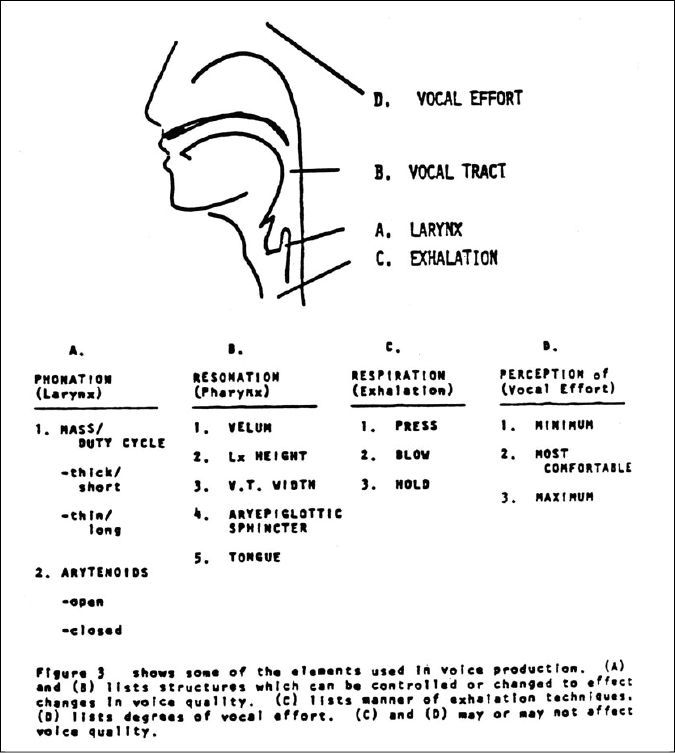

# Estill Voice Model 的起源与发展

> 译者：这篇真的好长好长（20多页……），所以先翻译Figure相关的内容啦（躺

## 指导原则

## 长达十年的研究

## 研究的重叠与 Estill Voice Model 的发展

在 1977 和 1978 年，北部医学中心的耳鼻咽喉学部在一个名为“歌手的发声科学”的教学声乐老师的课程中展现了他们的观察报告。这个课程后来发展成“声乐：声音和科学”，在 1979、1980、1981、1982 和 1984 年间开课。在这段时期，Falsetto 和 Belting 被添加为第五和第六品质（？）。在 1982，Estill 在第 11 届专业发声的保护专题研讨会中，发表了一篇具有重大意义的论文，“声质的控制”，总结了她在这七年间研究的发现。她的研究确定了七种结构在四种发声模式中处于两种情况中的一种。（？）

<small>**IMAGE 2-14**: Estill Voice Model 的起源</small>

> 在上面提到的论文和章节的讨论中，我们提出了这样的设想：如果该机制中（？）的结构产生了单独对应每种声质的构造，那一定存在某种独立移动或者控制这些生理结构的方法。（？）如果这是真的，那声音训练可以通过精通一些“必要的关键训练”达成——训练和测试独立运动那些关键结构的练习。