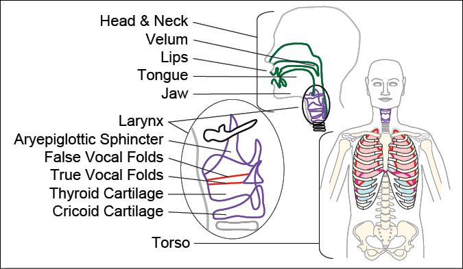

# Estill Voice Training 介绍

## Estill Voice Training™ 练习原则
- 知识就是力量，明白如何正确发声是件好事。
- 声音的产生在 声音在被听到*之前* 就开始了，是肌肉的运作让这件事发生的。
- 必须让呼吸对它呼出时遇到的东西做出反应。[（？）](issues.md#1)
- 声音训练在分成三部分的时候是最有效的：创造，艺术，和表演魔术。[（？）](issues.md#1)

在你读这本书的时候，把你的声音想象成一种乐器。像 Jo Estill 对她自己声音的评价一样：

> 你的声音是一种罕见的乐器。你的声音产生的方式就像任何其他乐器一样，但不只是一种乐器。它可以被改变和塑形，像很多不同的乐器那样发音——双簧管，小号，长笛——它是一个微缩的管弦乐队。打着灯笼都找不到像这样好的乐器，但是它在你出生的时候就有了。
> 所以，用这个乐器要知道什么呢？很简单。
> 1. 你要知道你可以控制这个乐器的哪些部分。有三个部分和 13 个组件是你可以学会独立控制的。
> 2. 你要体会到，把每一个部分移动到它们各自的两到三个极限的位置时的感觉。打个比方，这些部分就像其他乐器的琴键一样，当你移动它们，它们的声音就会改变。
> 3. 你要知道，把每一个部分移动到它们各自的两到三个极限的位置时，你的声音会发生什么变化。  
> 
> 而且，你可以通过“制造噪音”学到所有这些东西——所有长大的时候，不被允许的噪音：说话、哭号、呜咽、抱怨、啜泣、叫喊。

## Power-Source-Filter

**Power-Source-Filter (P-S-F) 声音产生理论**是 Estill Voice Model 背后的支柱。根据 P-S-F，声音是依据下面的方式产生的：

1. 声音产生所需的 **Power（力量）** 是气息。肺部产生的气息变成了让真声带震动的能量。
2. 声音的 **Source（来源）** 是真声带。当气息穿过真声带的边缘时，气流速率和声门下压力迫使声带的弹性组织互相靠近和远离。当声带震动时，空气分子靠近又弹开，产生了声波。如果声波是周期性的，它会在声带震动的速度和强度的基础上产生音高和响度。但是，原始的声波听起来其实像嗡嗡声。原始的音色在经过声道空间的共鸣处理后，变得可辨认。
3. 原始的声音的 **Filter（滤波器）** 是声道，或者说，所有声带以上的空间。“滤波器”包括了喉部、咽部、口腔、鼻子的空间。声道中的所有腔体都为共鸣做出了贡献。当空间改变形状时，它的共鸣的频率中心[（？）](issues.md#2)也会改变。在原始的声音经过声道时，所有的这些腔体过滤掉了让声音听起来像嗡嗡声的频率，使共振峰突出，从而令声音显现。[（？）](issues.md#2)这一过滤过程产生了你独特的音质，以及你用来沟通的元音和辅音。

来自 Power，Source，和 Filter 的贡献，奠定了 Estill Voice Model 理论最重要的 13 种生理结构 的基本原理。比起传统声乐教学中不客观的描述性语言，Estill 选择了在教学中使用科学术语。  

  
<small>**Image 3-1**: Estill Voice Training 中包括的结构</small>

Estill 的研究表明，这 13 个结构的移动都能在音质中产生明显的，能被听见、感觉和看见的改变。她在《Estill Figures for Voice》中运用了控制和学习发声肌肉运动的原则，对每个结构进行独立的精确控制的训练。她的 Estill Voice Training 练习原则强调了她针对改善说话和表演时的声音表现的创新性的方法。  

## 肌肉运动学习和 Attractor States

学习发声肌肉控制的技巧要解决很多挑战。在任何肌肉控制的项目里，运动是通过反馈来改进的。在大多数情况，进步是通过客观的测量来衡量的——“我冲刺的时间少了三秒。”“这次比赛我拿到更高的分数了。”“我能用正确的指法弹奏所有大调和小调了。”但是，在声乐里，很难定义一个客观的目标，而且几乎所有的评判都是主观的。“我喜欢那种声音和感觉吗？”“我的听众的反响好吗？”“这样的声音适合这个职业吗？”当我们独自练习时，所有的反馈都是含混不清的。我们所听见自己的声音，和别人听见我们的声音很不一样。我们看不见自己的解剖结构，而且感觉哪一部分在移动是很困难的。我们可以举起自己的手臂，而且闭着眼睛也知道它在哪。然而不管我们闭不闭眼，别管感觉了，我们连“呈现声音”的那部分的名字都叫不出来。Estill Voice Training 提供了那些部分的名字，多样的反馈机制来估测进步，和用于特定目标的练习。
